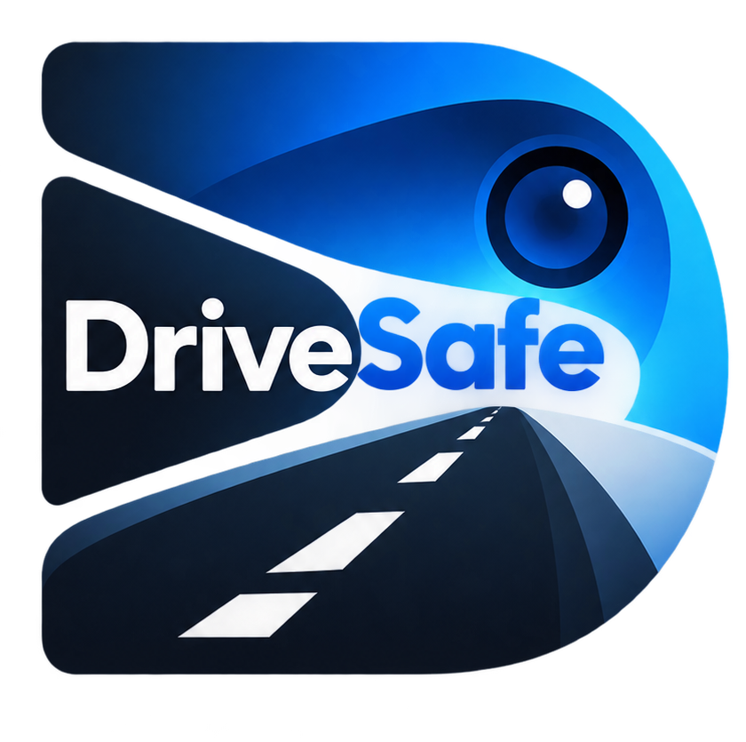
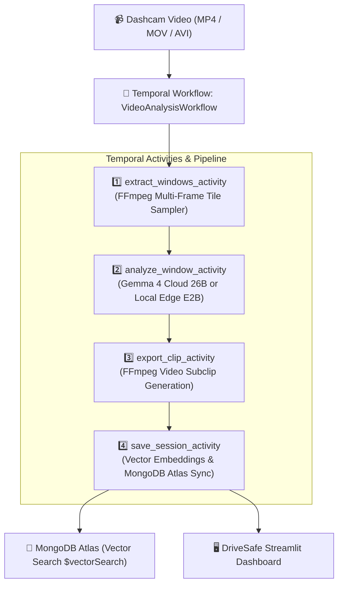

# 🚗 DriveSafe — Durable Dashcam Review & AI Vector Search

<div align="center">
  
  <h3>Intelligent Dashcam Footage Review powered by Google Gemma 4, Temporal Workflows &amp; MongoDB Atlas</h3>
</div>

---

## 🌟 Overview

**DriveSafe** is an intelligent, privacy-first dashcam footage analysis and long-term search platform. It automatically reviews driving recordings, identifies potential road safety events (e.g., pedestrians, cyclists, close vehicle encounters, sudden visual scene changes), generates interactive visual timelines, and indexes every moment into a vector database for natural-language search.

### 🏆 Key Highlights:
- **🔄 Durable Orchestration with Temporal**: End-to-end video analysis pipeline orchestrated as a resilient, fault-tolerant Temporal Workflow with real-time progress queries, exponential backoff retries, and decoupled activity workers.
- **🧠 Dual Inference Architecture (Google Gemma 4)**:
  - **☁️ Cloud Mode**: Google **Gemma 4 26B** (`gemma-4-26b-a4b-it`) via Gemini API for ultra-high-resolution multi-frame video scene understanding.
  - **💻 Local Edge Mode**: Google **Gemma 4 E2B** / **Gemma 3 4B** via Ollama for 100% private, offline, bare-metal edge processing (supports up to **60 minutes / 2 GB** footage).
- **🔍 Long-Term Memory & Vector Search (MongoDB Atlas)**:
  - Every detected driving event is embedded into a **768-dimensional vector space** using `nomic-embed-text`.
  - Stored in MongoDB with support for native **MongoDB Atlas `$vectorSearch`** and exact cosine similarity search across historical drives.
- **📂 Historical Video Library**:
  - Interactive library of all previously analyzed drives. Reload any historical trip into the visual inspector in 1 click without re-running model inference.
- **🐳 1-Click Docker Deployment**:
  - Full multi-container Docker stack (`app`, `mongodb`, `ollama`) running locally out-of-the-box with zero setup.

---

## 🏗️ Architecture



---

## 🚀 Quick Start with Docker (1-Click)

The easiest way to run DriveSafe completely offline and locally:

```bash
git clone https://github.com/your-username/drivesafe.git
cd drivesafe
docker compose up -d
```

Open **`http://localhost:8501`** in your browser.

> [!NOTE]
> By default, the Docker compose stack runs **100% locally** with bundled MongoDB 7.0 and Ollama without requiring any API key or `.env` file.

---

## 💻 Manual / Local Installation

### Prerequisites:
- **Python 3.10+**
- **FFmpeg** installed on your system PATH
- **Ollama** (for local edge model) or a **Google AI Studio API Key** (for cloud mode)
- **MongoDB** (Local instance or MongoDB Atlas cluster)

### Setup:

1. **Clone the repository and create virtual environment**:
   ```bash
   git clone https://github.com/your-username/drivesafe.git
   cd drivesafe
   python -m venv .venv
   
   # Windows PowerShell:
   .\.venv\Scripts\Activate.ps1
   # macOS / Linux:
   source .venv/bin/activate
   ```

2. **Install dependencies**:
   ```bash
   pip install -r requirements.txt
   ```

3. **Configure Environment Variables** (Optional):
   Copy `.env.example` to `.env`:
   ```bash
   cp .env.example .env
   ```
   Edit `.env` to configure your settings:
   ```env
   # Google Cloud / Gemini API (Optional for Gemma 4 26B)
   GEMINI_API_KEY=your_key_here
   GOOGLE_CLOUD_MODEL=gemma-4-26b-a4b-it

   # Ollama Configuration
   DRIVESAFE_OLLAMA_URL=http://127.0.0.1:11434
   DRIVESAFE_MODEL=gemma4:e2b
   DRIVESAFE_EMBEDDING_MODEL=nomic-embed-text

   # MongoDB Configuration
   DRIVESAFE_MONGO_URI=mongodb://127.0.0.1:27017
   DRIVESAFE_MONGO_DB=drivesafe
   ```

4. **Pull Local Models** (if using Local Edge):
   ```bash
   ollama pull gemma4:e2b
   ollama pull nomic-embed-text
   ```

5. **Start DriveSafe App**:
   ```bash
   streamlit run app.py
   ```
   Open **`http://127.0.0.1:8501`**.

---

## 🧪 Verification & Testing Suite

Run the full end-to-end test suite to verify all Temporal activities, workflow orchestration, Gemma 4 vision inference, and vector search:

```bash
python verify_all_temporal.py
```

### Tests Included:
- **`[TEST 1/3]` Direct Activities Verification**: Tests frame extraction, Gemma 4 vision detection, FFmpeg clip generation, and MongoDB vector storage.
- **`[TEST 2/3]` Temporal Workflow Orchestration**: Tests full `VideoAnalysisWorkflow` execution in a Temporal environment, querying real-time step progress and heartbeats.
- **`[TEST 3/3]` Streamlit Async Integration**: Verifies the UI workflow execution helper and session persistence.

---

## 🔒 Privacy & Safety Notice

- **Local Edge Mode**: Footage remains 100% on your local machine. No video frames, images, or telemetry are ever sent to external cloud servers.
- **Cloud Mode**: When Gemini API mode is selected, sampled frame contact sheets are transmitted over encrypted TLS directly to Google Gemini API for inference.
- **Audit Tool Disclaimer**: DriveSafe is an AI review aid designed to highlight moments for human review. It is not an autonomous collision detector and cannot establish legal fault or replace original recordings.

---

## 📄 License
MIT License &copy; 2026 DriveSafe Team. Built for the Hacktober Hackathon.
